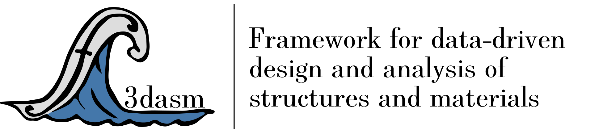

|

Summary
-------

Welcome to the documentation page of the optimization extension of the 'Framework for Data-Driven Design and Analysis of Structures and Materials' (:mod:`f3dasm_optimize`).
Here you will find all information on installing, using and contributing to the Python package.

.. warning::
    **This package is not standalone and requires the f3dasm package to be installed.**
    If you want more information on the :mod:`f3dasm` main package, go the the `documentation page <https://f3dasm.readthedocs.io/>`_
    There you will find a getting started, statement of need, installation instructions and much more.

Authorship & Citation
---------------------

:mod:`f3dasm_optimize` was originally created by by Martin van der Schelling [1]_.

.. [1] PhD Candiate, Delft University of Technology, `Website <https://mpvanderschelling.github.io/>`_ , `GitHub <https://github.com/mpvanderschelling/>`_

.. note::

   If you use ``f3dasm`` in your research or in a scientific publication, it is appreciated that you cite the paper below:

   **Journal of Open Source Software** (`paper <https://doi.org/10.21105/joss.06912>`_):

   .. code-block:: bibtex

      @article{vanderSchelling2024,
        title = {f3dasm: Framework for Data-Driven Design and Analysis of Structures and Materials},
        author = {M. P. van der Schelling and B. P. Ferreira and M. A. Bessa},
        doi = {10.21105/joss.06912},
        url = {https://doi.org/10.21105/joss.06912},
        year = {2024},
        publisher = {The Open Journal},
        volume = {9},
        number = {100},
        pages = {6912},
        journal = {Journal of Open Source Software}
      }

----

Contribute
----------
:mod:`f3dasm_optimize` is an open-source project, and contributions of any kind are welcome and appreciated. If you want to contribute, please go to the `GitHub page <https://github.com/bessagroup/f3dasm_optimize/>`_.

License
-------
Copyright 2025, Martin van der Schelling

All rights reserved.

:mod:`f3dasm_optimize` is a free and open-source software published under a `BSD 3-Clause License <https://github.com/bessagroup/f3dasm_optimize/blob/main/LICENSE>`_.
